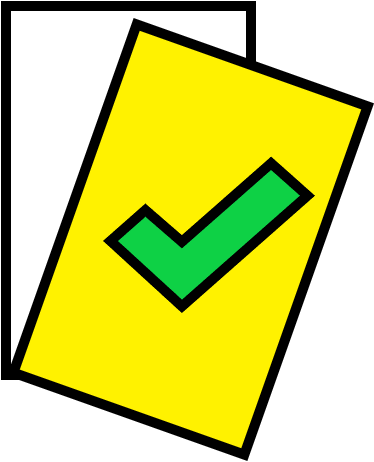

<!--
*** Thanks for checking out the Best-README-Template. If you have a suggestion
*** that would make this better, please fork the repo and create a pull request
*** or simply open an issue with the tag "enhancement".
*** Thanks again! Now go create something AMAZING! :D
-->


<!-- PROJECT SHIELDS -->
<!--
*** I'm using markdown "reference style" links for readability.
*** Reference links are enclosed in brackets [ ] instead of parentheses ( ).
*** See the bottom of this document for the declaration of the reference variables
*** for contributors-url, forks-url, etc. This is an optional, concise syntax you may use.
*** https://www.markdownguide.org/basic-syntax/#reference-style-links
-->
[![Contributors][contributors-shield]][contributors-url]
[![Forks][forks-shield]][forks-url]
[![Stargazers][stars-shield]][stars-url]
[![Issues][issues-shield]][issues-url]
[![MIT License][license-shield]][license-url]
[![LinkedIn][linkedin-shield]][linkedin-url]


<!-- PROJECT LOGO -->
<br />
<p align="center">
  <a href="https://github.com/Mr-645/Mappe">
    
  </a>

  <h3 align="center">Mappe</h3>

  <p align="center">
    SOP document management software
    <br />
    <a href="https://github.com/Mr-645/Mappe/issues">Report Bug</a>
    ·
    <a href="https://github.com/Mr-645/Mappe/issues">Request Feature</a>
  </p>
</p>


<!-- TABLE OF CONTENTS -->
<details open="open">
  <summary>Table of Contents</summary>
  <ol>
    <li>
      <a href="#about-the-project">About The Project</a>
      <ul>
        <li><a href="#built-with">Built With</a></li>
      </ul>
    </li>
    <li>
      <a href="#getting-started">Getting Started</a>
      <ul>
        <li><a href="#prerequisites">Prerequisites</a></li>
        <li><a href="#installation">Installation</a></li>
      </ul>
    </li>
    <li><a href="#license">License</a></li>
  </ol>
</details>


<!-- ABOUT THE PROJECT -->
## About The Project

<i>There's not a great deal I can reveal about this project, but here's a bit of what I can reveal</i>

These are the remains of an abandoned software project that was ~90% complete before it was decommissioned.

Its primary functions are:
* Create a new SOP, and subsequent training documents from a standardised template
* Manage the documents by accounting for them and their status using an SQL database
* Easy to use and install GUI interface

### Built With

This section should list any major frameworks that you built your project using. Leave any add-ons/plugins for the acknowledgements section. Here are a few examples.
* Python 3
* SQL (SQLite)
* Qt (PyQt5)

<!-- GETTING STARTED -->
## Getting Started

It's all in "testing_ground/test6.py"

### Prerequisites

This is an example of how to list things you need to use the software and how to install them.
* python 3
* PyQt5
* SQLite
  ```sh
  pip3 install pyqt5
  ```

<!-- LICENSE -->
## License

Distributed under the MIT License. See `LICENSE` for more information.

<!-- MARKDOWN LINKS & IMAGES -->
<!-- https://www.markdownguide.org/basic-syntax/#reference-style-links -->
[contributors-shield]: https://img.shields.io/github/contributors/Mr-645/Mappe.svg?style=for-the-badge
[contributors-url]: https://github.com/Mr-645/Mappe/graphs/contributors
[forks-shield]: https://img.shields.io/github/forks/Mr-645/Mappe.svg?style=for-the-badge
[forks-url]: https://github.com/Mr-645/Mappe/network/members
[stars-shield]: https://img.shields.io/github/stars/Mr-645/Mappe.svg?style=for-the-badge
[stars-url]: https://github.com/Mr-645/Mappe/stargazers
[issues-shield]: https://img.shields.io/github/issues/Mr-645/Mappe.svg?style=for-the-badge
[issues-url]: https://github.com/Mr-645/Mappe/issues
[license-shield]: https://img.shields.io/github/license/Mr-645/Mappe.svg?style=for-the-badge
[license-url]: https://github.com/Mr-645/Mappe/blob/master/LICENSE
[linkedin-shield]: https://img.shields.io/badge/-LinkedIn-black.svg?style=for-the-badge&logo=linkedin&colorB=555
[linkedin-url]: https://linkedin.com/in/othneildrew
[product-screenshot]: images/screenshot.png
